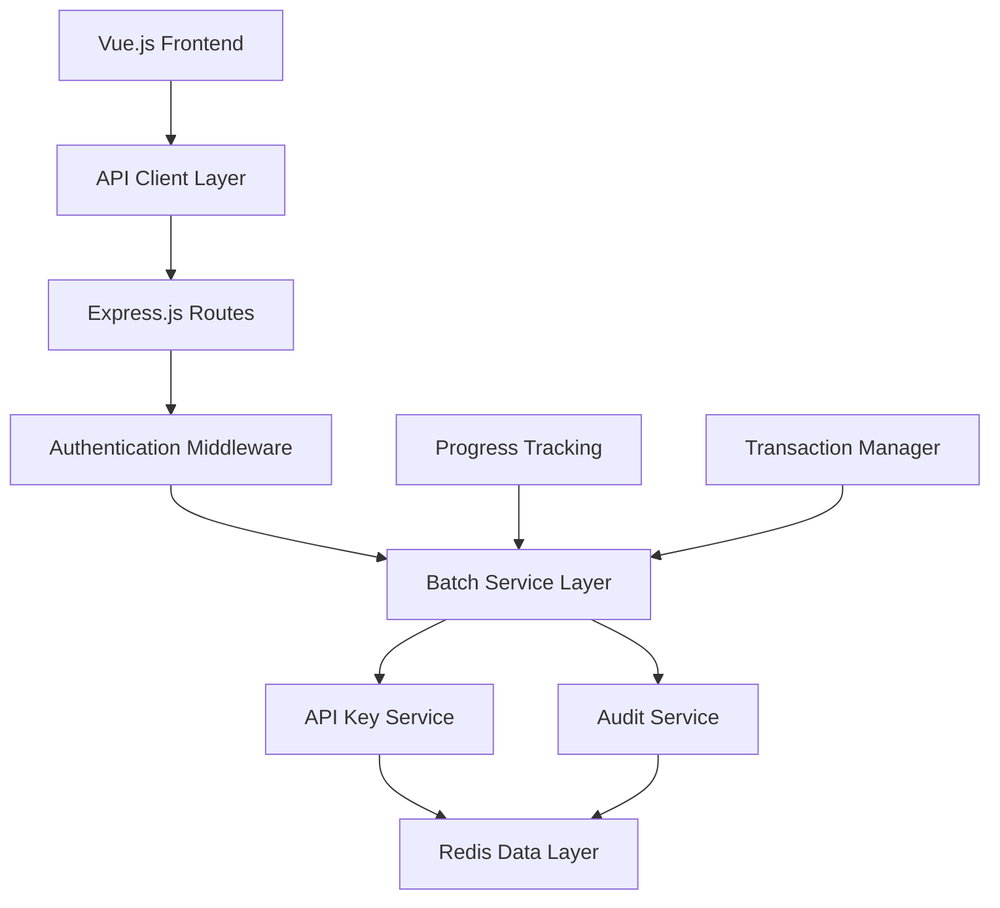

# Design Document

## Overview

The API Keys Batch Management feature extends the existing Claude Relay Service infrastructure to provide comprehensive batch operations for API key management. The design leverages the current Vue.js 3 frontend architecture, Express.js backend routing, and Redis data persistence while introducing new batch operation services and enhanced user interface components.

The solution follows the established patterns in the codebase: service-oriented backend architecture, middleware-based authentication, and reactive frontend components with modern UI/UX design principles.

## Steering Document Alignment

### Technical Standards (tech.md)
The implementation follows Node.js/Express.js backend patterns and Vue.js 3 Composition API frontend architecture established in the project. All batch operations maintain consistency with existing API key management patterns and security middleware.

### Project Structure (structure.md)
New components will be organized following the existing structure:
- Backend services in `src/services/`
- API routes in `src/routes/admin.js`
- Frontend components in `web/admin-spa/src/components/`
- Utilities in respective `utils/` directories

## Code Reuse Analysis

### Existing Components to Leverage
- **ApiKeyService**: Extend with batch operation methods for tag management, account assignment, and status updates
- **Redis Model**: Utilize existing `redis.js` methods for data persistence and add batch-specific operations
- **Admin Authentication**: Reuse `authenticateAdmin` middleware for securing batch operations
- **ApiKeysView.vue**: Extend existing multi-select implementation with enhanced batch operation controls
- **API Client**: Extend existing `apiClient` with batch operation endpoints

### Integration Points
- **Existing Batch Delete**: Build upon current batch delete infrastructure in admin routes
- **Multi-select State**: Enhance existing `selectedApiKeys`, `selectAllChecked`, `isIndeterminate` reactive state
- **Logger Service**: Integrate with existing Winston logging for audit trails
- **Toast Notifications**: Use existing toast system for batch operation feedback

## Architecture

The batch management system follows a layered architecture pattern consistent with the existing codebase:



### Modular Design Principles
- **Single File Responsibility**: Each batch operation type (tags, accounts, status) handled by focused service modules
- **Component Isolation**: UI components separated by operation type with shared base components
- **Service Layer Separation**: Clear separation between data access (Redis), business logic (services), and presentation (Vue components)
- **Utility Modularity**: Batch operation utilities organized by function (validation, progress tracking, audit logging)

## Components and Interfaces

### Backend Components

#### BatchOperationService
- **Purpose**: Orchestrates batch operations with transaction management and progress tracking
- **Interfaces**: 
  - `batchUpdateTags(keyIds, tagsToAdd, tagsToRemove)`
  - `batchUpdateAccounts(keyIds, accountAssignments)`
  - `batchUpdateStatus(keyIds, isActive)`
  - `getBatchProgress(operationId)`
- **Dependencies**: ApiKeyService, AuditService, Redis
- **Reuses**: Existing error handling patterns from admin routes

#### BatchTagService
- **Purpose**: Handles tag-specific batch operations with conflict resolution
- **Interfaces**:
  - `addTagsToKeys(keyIds, tags)`
  - `removeTagsFromKeys(keyIds, tags)`
  - `getTagConflicts(keyIds, newTags)`
- **Dependencies**: Redis, Logger
- **Reuses**: Existing tag parsing and validation logic from ApiKeyService

#### BatchAccountService  
- **Purpose**: Manages account assignment operations with validation
- **Interfaces**:
  - `assignAccounts(keyIds, accountData)`
  - `validateAccountAssignments(assignments)`
  - `resolveAccountConflicts(keyIds, accountData)`
- **Dependencies**: Account validation services, Redis
- **Reuses**: Existing account validation from ApiKeyService

#### AuditService
- **Purpose**: Comprehensive logging and audit trail management
- **Interfaces**:
  - `logBatchOperation(operationType, keyIds, changes, adminId)`
  - `createAuditEntry(keyId, beforeState, afterState, operation)`
  - `exportAuditData(filters)`
- **Dependencies**: Logger, Redis
- **Reuses**: Existing Winston logger configuration

### Frontend Components

#### BatchOperationPanel.vue
- **Purpose**: Main batch operation interface with operation selection and progress display
- **Interfaces**: 
  - Props: `selectedKeys`, `availableOperations`
  - Events: `@operation-selected`, `@operation-cancelled`
- **Dependencies**: API Client, Toast service
- **Reuses**: Existing modal patterns and button components

#### TagManagementModal.vue
- **Purpose**: Specialized modal for batch tag operations
- **Interfaces**:
  - Props: `selectedKeys`, `existingTags`
  - Events: `@tags-updated`, `@operation-cancelled`
- **Dependencies**: Tag validation utilities
- **Reuses**: Existing modal base component and form validation patterns

#### AccountAssignmentModal.vue
- **Purpose**: Interface for batch account assignment
- **Interfaces**:
  - Props: `selectedKeys`, `availableAccounts`  
  - Events: `@accounts-assigned`, `@operation-cancelled`
- **Dependencies**: Account service, validation utilities
- **Reuses**: Existing dropdown components and form validation

#### BatchProgressTracker.vue
- **Purpose**: Real-time progress display for batch operations
- **Interfaces**:
  - Props: `operationId`, `totalItems`
  - Events: `@operation-complete`, `@operation-failed`
- **Dependencies**: WebSocket or polling service for real-time updates
- **Reuses**: Existing progress bar components and loading states

## Data Models

### BatchOperation
```javascript
{
  id: "string",              // Unique operation identifier
  type: "string",            // 'tag-update', 'account-assignment', 'status-change'
  keyIds: ["string"],        // Array of API key IDs
  adminId: "string",         // Administrator performing operation
  status: "string",          // 'pending', 'in-progress', 'completed', 'failed'
  progress: {
    total: "number",         // Total items to process
    completed: "number",     // Items completed
    failed: "number",        // Items failed
    errors: ["object"]       // Error details for failed items
  },
  data: "object",            // Operation-specific data (tags, accounts, etc.)
  createdAt: "timestamp",
  completedAt: "timestamp",
  result: "object"           // Operation results and summary
}
```

### BatchTagUpdate
```javascript
{
  tagsToAdd: ["string"],     // Tags to add to selected keys
  tagsToRemove: ["string"],  // Tags to remove from selected keys
  conflictResolution: "string", // 'merge', 'replace', 'skip'
  preserveExisting: "boolean"   // Whether to preserve existing tags
}
```

### BatchAccountAssignment
```javascript
{
  claudeAccountId: "string",       // Claude account ID (optional)
  geminiAccountId: "string",       // Gemini account ID (optional)
  openaiAccountId: "string",       // OpenAI account ID (optional)
  bedrockAccountId: "string",      // Bedrock account ID (optional)
  overwriteExisting: "boolean",    // Whether to overwrite existing assignments
  conflictResolution: "string"     // How to handle conflicts
}
```

### AuditEntry
```javascript
{
  id: "string",
  keyId: "string",           // Affected API key ID
  operationId: "string",     // Batch operation ID
  adminId: "string",         // Administrator ID
  operationType: "string",   // Type of operation performed
  beforeState: "object",     // State before change
  afterState: "object",      // State after change
  timestamp: "timestamp",
  success: "boolean",
  errorMessage: "string"     // Error details if operation failed
}
```

## Error Handling

### Error Scenarios

1. **Partial Operation Failure**
   - **Handling**: Continue processing remaining items, collect all errors, provide detailed failure report
   - **User Impact**: User sees summary of successful/failed operations with specific error details

2. **Transaction Rollback Required**
   - **Handling**: Implement Redis transactions for atomic operations, rollback on critical failures
   - **User Impact**: Clear indication that operation was cancelled and no changes were made

3. **Concurrent Operation Conflict**
   - **Handling**: Use Redis locks to prevent concurrent batch operations on same keys
   - **User Impact**: User informed that operation cannot proceed due to conflict, suggested retry timing

4. **Network/Database Connection Issues**
   - **Handling**: Implement retry logic with exponential backoff, save operation state for recovery
   - **User Impact**: Progress preserved, operation can be resumed when connection restored

5. **Invalid Data Validation Errors**
   - **Handling**: Pre-validate all data before starting operation, provide specific validation errors
   - **User Impact**: Clear validation feedback before operation starts, prevents wasted processing

## Testing Strategy

### Unit Testing
- **Service Layer Testing**: Test each batch service independently with mocked dependencies
- **Validation Logic**: Test tag validation, account assignment validation, and conflict resolution
- **Error Handling**: Test error scenarios, rollback mechanisms, and partial failure handling
- **Audit Logging**: Verify audit entries are created correctly for all operations

### Integration Testing
- **API Endpoint Testing**: Test batch operation endpoints with various data combinations
- **Database Integration**: Test Redis transactions and data consistency
- **Authentication**: Verify admin authentication for all batch operations
- **Cross-service Communication**: Test interaction between batch services and existing services

### End-to-End Testing
- **Complete User Workflows**: Test full batch operation workflows from UI to database
- **Multi-select Interactions**: Test selection persistence across search and pagination
- **Progress Tracking**: Verify real-time progress updates and completion notifications
- **Error Recovery**: Test user experience during various error scenarios

### Performance Testing
- **Large Batch Operations**: Test performance with 100, 500, and 1000 API keys
- **Concurrent User Operations**: Test system behavior with multiple administrators
- **Memory Usage**: Monitor memory consumption during large batch operations
- **Response Times**: Ensure UI responsiveness during background processing