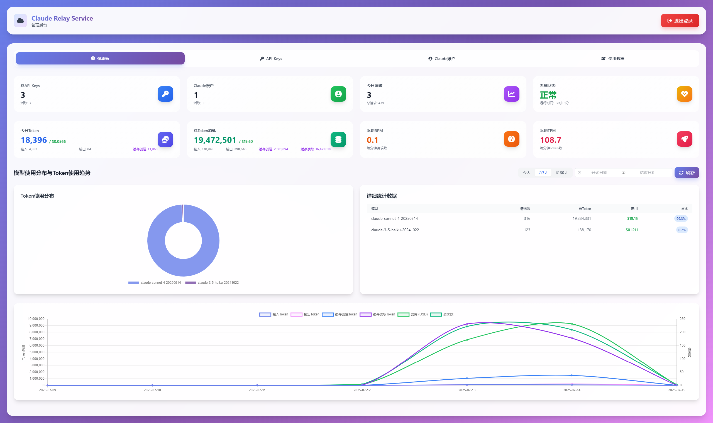
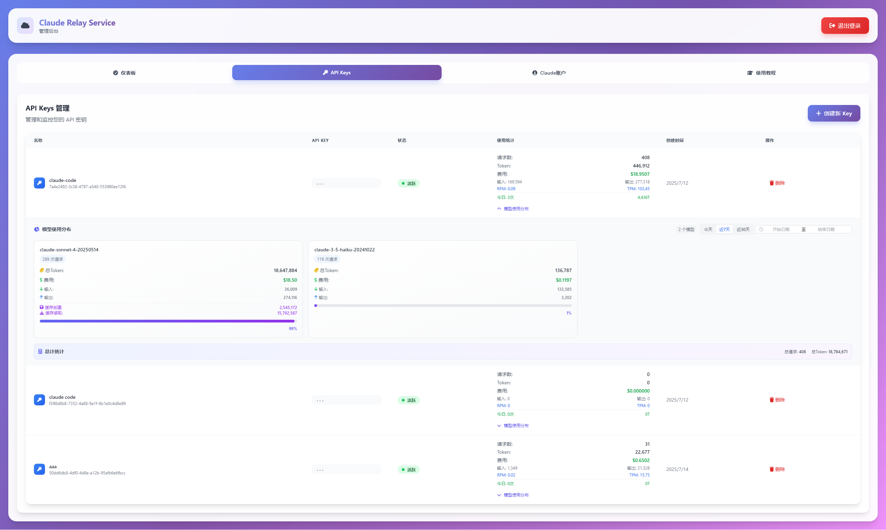
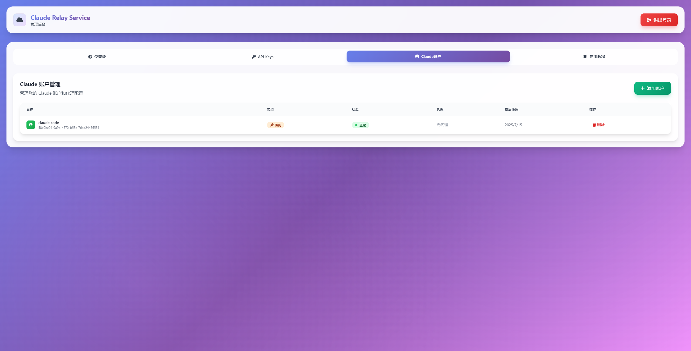
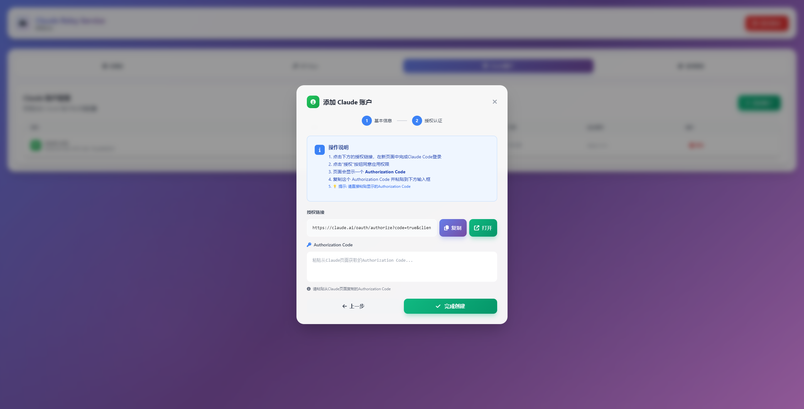
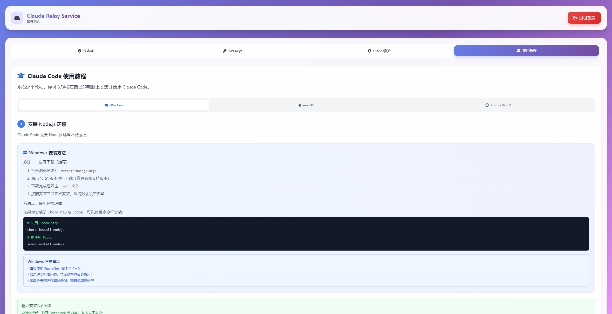

# Claude Relay Service 界面预览

**🎨 Web管理界面截图展示**

---

## 📊 管理面板概览

### 仪表板

*实时显示API调用次数、Token使用量、成本统计等关键指标*

---

## 🔑 API密钥管理

### API密钥列表

*查看和管理所有创建的API密钥，包括使用量统计和状态信息*

---

## 👤 Claude账户管理

### 账户列表

*管理多个Claude账户，查看账户状态和使用情况*

### 添加新账户

*通过OAuth授权添加新的Claude账户*

### 使用教程

*windows、macos、linux、wsl不同环境的claude code安装教程*

---
